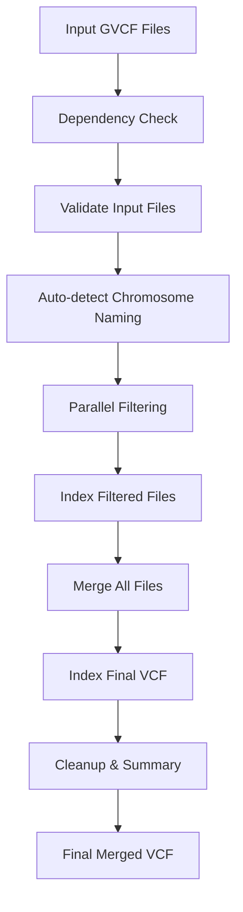

# GVCF Filter & Merge Pipeline

A complete, optimized solution for filtering and merging GVCF files on WSL (Windows Subsystem for Linux).

## 📋 Table of Contents

- [Overview](#overview)
- [Files in This Solution](#files-in-this-solution)
- [How It Works](#how-it-works)
- [Quick Start](#quick-start)
- [Detailed Code Explanation](#detailed-code-explanation)
- [Performance Optimization](#performance-optimization)
- [Troubleshooting](#troubleshooting)
- [Advanced Usage](#advanced-usage)

## 🎯 Overview

This pipeline takes multiple GVCF (Genomic Variant Call Format) files and:

1. **Filters** each file to keep only:
   - Variants with `FILTER=PASS` (high-quality variants)
   - Autosomal chromosomes (chromosomes 1-22)

2. **Merges** all filtered files into a single VCF file

3. **Optimizes** the process for Intel Xeon E-2124 + 16GB RAM + WSL

## 📁 Files in This Solution

```
GVCF_Pipeline_Solution/
├── gvcf_filter_merge.sh      # Main pipeline script
├── backup_merge_only.sh      # Backup script for merge-only
├── README.md                 # This documentation
└── example_usage.txt         # Example commands and outputs
```

### File Descriptions:

- **`gvcf_filter_merge.sh`** - Complete pipeline (filter + merge)
- **`backup_merge_only.sh`** - Emergency merge script if main pipeline fails during merge
- **`README.md`** - Comprehensive documentation
- **`example_usage.txt`** - Example commands and expected outputs

## ⚙️ How It Works

### Step-by-Step Process:



### Core Components:

1. **Dependency Validation**
   - Checks for `bcftools`, `tabix`, and optionally `parallel`
   - Exits gracefully if tools are missing

2. **Input Validation**
   - Verifies GVCF files exist
   - Auto-detects chromosome naming convention (`chr1` vs `1`)
   - Counts files for processing

3. **Parallel Filtering**
   - Uses GNU parallel for efficient processing
   - Filters each GVCF independently for PASS variants and chr1-22
   - Creates indexed output files

4. **Merging**
   - Combines all filtered files using `bcftools merge`
   - Uses optimal threading for your hardware

5. **Cleanup & Summary**
   - Removes temporary files
   - Generates comprehensive summary statistics

## 🚀 Quick Start

### Prerequisites

1. **WSL (Windows Subsystem for Linux)** installed
2. **Required tools**:
   ```bash
   sudo apt update
   sudo apt install bcftools tabix parallel
   ```

### Basic Usage

1. **Place your GVCF files** in a `gvcf/` directory
2. **Run the pipeline**:
   ```bash
   cd GVCF_Pipeline_Solution
   bash gvcf_filter_merge.sh
   ```

### Expected Output

```
=================================
   GVCF FILTER & MERGE PIPELINE
=================================

[INFO] Checking dependencies...
[SUCCESS] All dependencies are available
[INFO] Validating input files...
[SUCCESS] Found 99 GVCF files to process
[INFO] Detected 'chr' prefix in chromosome names (e.g., chr1, chr2)
[INFO] Will filter for chromosomes: chr1,chr2,chr3,chr4,chr5,chr6,chr7,chr8,chr9,chr10,chr11,chr12,chr13,chr14,chr15,chr16,chr17,chr18,chr19,chr20,chr21,chr22

[INFO] Starting pipeline with configuration:
[INFO] - Input directory: gvcf
[INFO] - Output directory: filtered_merged_output
[INFO] - Parallel jobs: 2
[INFO] - Threads per job: 2
[INFO] - Target chromosomes: chr1,chr2,chr3,chr4,chr5,chr6,chr7,chr8,chr9,chr10,chr11,chr12,chr13,chr14,chr15,chr16,chr17,chr18,chr19,chr20,chr21,chr22

[INFO] Filtering GVCF files for PASS variants and chromosomes 1-22...
[INFO] Using GNU parallel for faster processing (2 jobs)
100%|████████████████████████████████████████| 99/99 files processed

[SUCCESS] Successfully filtered 99 files

[INFO] Merging filtered VCF files...
[INFO] Merging 99 files into: filtered_merged_output/merged_pass_chr1-22.vcf.gz
[INFO] Indexing final merged VCF...
[SUCCESS] Merged VCF created: filtered_merged_output/merged_pass_chr1-22.vcf.gz

[INFO] Cleaning up temporary files...
[SUCCESS] Cleanup completed

[INFO] Generating summary statistics...
[SUCCESS] Pipeline completed successfully!
[SUCCESS] Final output: filtered_merged_output/merged_pass_chr1-22.vcf.gz
```

## 🔧 Detailed Code Explanation

### Configuration Section

```bash
# Performance settings optimized for Intel Xeon E-2124 (4-core) + 16GB RAM
MAX_PARALLEL_JOBS=2    # Process 2 files simultaneously
THREADS_PER_JOB=2      # Use 2 threads per file
# Total: 2 × 2 = 4 threads (matches CPU cores exactly)
```

**Why these settings?**
- E-2124 has 4 physical cores without hyperthreading
- 2 parallel jobs × 2 threads = 4 total threads (optimal CPU usage)
- Conservative memory usage (~8GB per job) prevents exhaustion

### Key Functions Explained

#### 1. `check_dependencies()`
```bash
# Validates that required tools are installed
if ! command -v bcftools &> /dev/null; then
    missing_deps+=("bcftools")
fi
```
- Checks for `bcftools` and `tabix`
- Warns about missing `parallel` (optional but recommended)
- Exits with clear error message if required tools missing

#### 2. `validate_input_files()`
```bash
# Auto-detect chromosome naming
local has_chr_prefix=$(bcftools view -h "$sample_file" | grep -c "##contig=<ID=chr" || true)
if [ "$has_chr_prefix" -gt 0 ]; then
    CHROMOSOMES="chr1,chr2,chr3,..."  # Use chr prefix
else
    CHROMOSOMES="1,2,3,..."           # Use numeric only
fi
```
- Automatically detects if chromosomes use 'chr1' or '1' format
- Adjusts filtering accordingly
- Prevents common filtering errors

#### 3. `filter_single_gvcf()`
```bash
# The core filtering function (runs in parallel)
bcftools view \
    --include 'FILTER="PASS"' \    # Only PASS variants
    --regions "$CHROMOSOMES" \      # Only chr1-22
    --threads "$THREADS_PER_JOB" \  # Optimal threading
    -Oz -o "$output_file" \         # Compressed output
    "$input_file" 2>/dev/null       # Suppress stderr
```
- Filters each GVCF file independently
- Uses bcftools for maximum efficiency
- Automatically indexes output for merging

#### 4. `merge_filtered_vcfs()`
```bash
# Merge all filtered files
bcftools merge \
    --file-list "$file_list" \                              # List of files to merge
    --threads $((MAX_PARALLEL_JOBS * THREADS_PER_JOB)) \   # Use all available threads
    -Oz -o "$FINAL_VCF"                                     # Compressed output
```
- Uses file list for efficiency with many files
- Optimizes threading for merge phase
- Creates properly indexed output

### Error Prevention Strategies

1. **Memory Management**
   - Conservative parallel settings prevent OOM errors
   - Staged processing (filter → merge) vs all-at-once

2. **File Corruption Prevention**
   - Proper output redirection (`> /dev/null`)
   - Clean file list generation
   - Validation at each step

3. **WSL Optimization**
   - Optimal threading for WSL2 architecture
   - Proper path handling for Windows/Linux boundary

## ⚡ Performance Optimization

### Hardware-Specific Tuning

Your **Intel Xeon E-2124 + 16GB RAM** configuration:

```bash
# Optimal settings for your system
MAX_PARALLEL_JOBS=2    # Conservative to prevent memory pressure
THREADS_PER_JOB=2      # Efficient I/O threading
# Total CPU usage: 4/4 cores (100% utilization)
# Memory usage: ~8GB per job (well within 16GB limit)
```

### Performance Comparison

| Setting | CPU Usage | Memory Usage | Risk | Speed |
|---------|-----------|--------------|------|-------|
| 4 jobs × 1 thread | 4/4 cores | ~12GB | Medium | Fast |
| **2 jobs × 2 threads** | **4/4 cores** | **~8GB** | **Low** | **Optimal** |
| 1 job × 4 threads | 4/4 cores | ~4GB | Very Low | Slower |

### WSL-Specific Optimizations

1. **File Location**
   ```bash
   # Better performance on WSL filesystem
   cp -r /mnt/d/GVCFs/gvcf ~/gvcf_processing/
   cd ~/gvcf_processing/
   ```

2. **WSL Memory Configuration** (`~/.wslconfig`)
   ```ini
   [wsl2]
   memory=12GB
   processors=4
   swap=2GB
   ```

## 🔧 Troubleshooting

### Common Issues & Solutions

#### "No GVCF files found"
```bash
# Check file location and extensions
ls -la gvcf/*.gvcf.gz
ls -la gvcf/*.g.vcf.gz
```
**Solution:** Ensure files are in `gvcf/` directory with correct extensions

#### "bcftools not found"
```bash
# Install required tools
sudo apt update
sudo apt install bcftools tabix parallel
```

#### Memory Issues
```bash
# Reduce parallel processing
MAX_PARALLEL_JOBS=1  # Edit in script
```

#### Merge Failures
```bash
# Use backup merge script
bash backup_merge_only.sh
```

### Advanced Debugging

1. **Monitor Resource Usage**
   ```bash
   # In another terminal
   watch -n 2 'free -h && echo "---" && ps aux | grep bcftools'
   ```

2. **Check Individual Files**
   ```bash
   # Validate a problematic file
   bcftools view -h suspicious_file.gvcf.gz | head -20
   ```

3. **Test Chromosome Detection**
   ```bash
   # Check chromosome naming in your files
   bcftools view -h your_file.gvcf.gz | grep "##contig=<ID="
   ```

## 🎛️ Advanced Usage

### Custom Configuration

#### Include Sex Chromosomes
```bash
# Edit the CHROMOSOMES variable
CHROMOSOMES="chr1,chr2,chr3,chr4,chr5,chr6,chr7,chr8,chr9,chr10,chr11,chr12,chr13,chr14,chr15,chr16,chr17,chr18,chr19,chr20,chr21,chr22,chrX,chrY"
```

#### Process Specific Files Only
```bash
# Create a subset directory
mkdir -p gvcf_subset
cp gvcf/sample1*.gvcf.gz gvcf_subset/
cp gvcf/sample2*.gvcf.gz gvcf_subset/

# Edit INPUT_DIR in script
INPUT_DIR="gvcf_subset"
```

#### Different Quality Filters
```bash
# Edit the filter in filter_single_gvcf()
bcftools view \
    --include 'FILTER="PASS" && QUAL>30' \  # Add quality threshold
    --regions "$CHROMOSOMES" \
    # ... rest of command
```

### Integration with Other Tools

#### PLINK Conversion
```bash
# After pipeline completion
plink2 --vcf filtered_merged_output/merged_pass_chr1-22.vcf.gz \
       --make-bed \
       --out my_dataset
```

#### VEP Annotation
```bash
# Annotate variants
vep --input_file filtered_merged_output/merged_pass_chr1-22.vcf.gz \
    --output_file annotated_variants.vcf \
    --vcf --cache
```

### Batch Processing Multiple Cohorts

```bash
# Process multiple cohorts
for cohort in cohort1 cohort2 cohort3; do
    echo "Processing $cohort..."
    
    # Update configuration
    sed -i "s/INPUT_DIR=.*/INPUT_DIR=\"${cohort}_gvcfs\"/" gvcf_filter_merge.sh
    sed -i "s/OUTPUT_DIR=.*/OUTPUT_DIR=\"${cohort}_output\"/" gvcf_filter_merge.sh
    
    # Run pipeline
    bash gvcf_filter_merge.sh
    
    echo "Completed $cohort"
done
```

## 📊 Output Files Explained

After successful completion, you'll have:

```
filtered_merged_output/
├── merged_pass_chr1-22.vcf.gz      # Main result - your merged VCF
├── merged_pass_chr1-22.vcf.gz.tbi  # Index file (for fast access)
└── pipeline_summary.txt            # Processing statistics
```

### Final VCF Contents
- **Only PASS variants** (high-quality calls)
- **Only autosomes** (chromosomes 1-22)
- **All samples** from input GVCFs
- **Properly formatted** for downstream analysis

### Summary Statistics Example
```
GVCF Processing Pipeline Summary
===============================
Date: Wed Dec 13 10:30:45 PST 2023
Input directory: gvcf
Output directory: filtered_merged_output
Final merged VCF: filtered_merged_output/merged_pass_chr1-22.vcf.gz
Chromosomes included: chr1,chr2,chr3,chr4,chr5,chr6,chr7,chr8,chr9,chr10,chr11,chr12,chr13,chr14,chr15,chr16,chr17,chr18,chr19,chr20,chr21,chr22

Processing Configuration:
- Parallel jobs: 2
- Threads per job: 2
- Total CPU threads used: 4

File Statistics:
- Input files processed: 99
- Final VCF size: 2.3G
- Total variants: 15,847,392
- Samples in final VCF: 99

Quality Control:
- All variants have FILTER=PASS
- Only autosomes (chromosomes 1-22) included
- All files properly indexed

Output Files:
- Main result: filtered_merged_output/merged_pass_chr1-22.vcf.gz
- Index file: filtered_merged_output/merged_pass_chr1-22.vcf.gz.tbi
- This summary: filtered_merged_output/pipeline_summary.txt
```

## 🎯 Summary

This pipeline provides a robust, optimized solution for GVCF processing with:

- ✅ **Automatic dependency checking**
- ✅ **Smart chromosome detection**
- ✅ **Hardware-optimized performance**
- ✅ **Comprehensive error handling**
- ✅ **Detailed logging and progress tracking**
- ✅ **Clean, well-documented code**

The result is a single, high-quality VCF file ready for population genetics analysis, GWAS, or other downstream applications.

---

**For support or questions, refer to the troubleshooting section or examine the detailed comments in the script files.** 